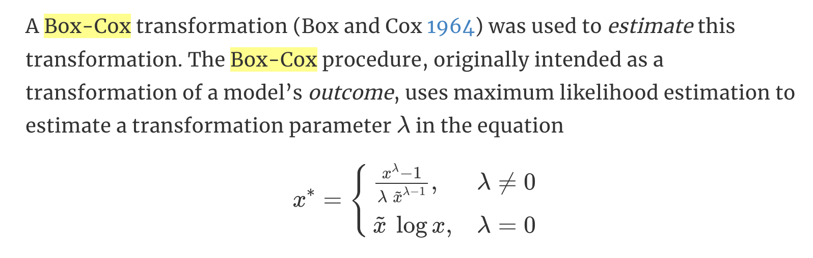

# Time series decomposition

**Learning objectives:**

-   how to split a time series into several components
-   combine the trend and cycle into a single trend-cycle component
-   extracting components from a time series

## Transformations and adjustments

To simplify the patterns in the historical data by removing known
sources of variation some adjustments are required:

-   **calendar adjustments**
-   **population adjustments** (data per person (or per thousand people,
    or per million people) rather than the total)
-   **inflation adjustments** (such as price index adjustments)
-   **mathematical transformations** (log/power/Box-Cox transformation,
    ...)

[Features by
package](https://fabletools.tidyverts.org/reference/features_by_pkg.html)
[Guerrero's method for Box Cox lambda
selection](https://feasts.tidyverts.org/reference/guerrero.html)

```{r message=FALSE, warning=FALSE}
library(fpp3)


lambda <- aus_production %>%
  features(Gas, features = guerrero) %>%
  pull(lambda_guerrero)


aus_production %>%
  autoplot(box_cox(Gas, lambda)) +
  labs(y = "",
       title = latex2exp::TeX(paste0(
         "Transformed gas production with $\\lambda$ = ",
         round(lambda,2))))+
  ggthemes::theme_pander()
```

## Time series components

**Time series** are made of three **components**:

-   a trend-cycle component $T_t$
-   a seasonal component $S_t$
-   a remainder component $R_t$

### Additive decomposition

When the variation around the **trend-cycle does not vary** with the
level of the time series.

$$y_t=S_t+T_t+R_t$$

### Multiplicative decomposition

When the variation in the seasonal pattern, or the variation around the
**trend-cycle**, appears to be **proportional** to the level of the time
series.

$$y_t=S_t*T_t*R_t$$ An alternative can be a **log transformation**

$$log(y_t)=log(S_t)+log(T_t)+log(R_t)$$

### Example: Employment in the US retail sector

A nice introduction to the use of the **{fpp3} package** by the author
is in the section *Example* at minute 13.11 here: [Dr. Rob J. Hyndman -
Ensemble Forecasts with
{fable}](https://www.youtube.com/watch?v=nMy98aqQj8c)

**Data**

```{r}
us_employment%>%head
```

#### STL decomposition method

Seasonal and Trend decomposition using Loess.

[STL produces a smoother trend than classical decomposition methods due
to the use of local polynomial
regression.](https://arxiv.org/pdf/2204.10398.pdf)

Some interesting information about the **STL model**:

-   it is additive
-   it is iterative and relies on the alternate estimation of the trend
-   the seasonal components are locally estimated scatterplot smoothing
    (Loess)
-   it estimates nonlinear relationships
-   the seasonal component is allowed to change over time
-   it is composed of seasonal patterns estimated based on k consecutive
    seasonal cycles
-   k controls how rapidly the seasonal component can change
-   it is robust to outliers and missing data
-   it is able to decompose time series with seasonality of any
    frequency, and provides implementation using numerical methods
    instead of mathematical modeling.

More info here: [R. B. Cleveland et al.
(1990)](https://www.scb.se/contentassets/ca21efb41fee47d293bbee5bf7be7fb3/stl-a-seasonal-trend-decomposition-procedure-based-on-loess.pdf)

[from the book](https://otexts.com/fpp3/stl.html)

The command used is:

     model(stl = STL(<formula>))

```{r}
us_employment%>% #year(Month) >= 1990, 
  filter(Title == "Retail Trade") %>%
  select(-Series_ID) %>%
  autoplot()
```

```{r}
us_retail_employment <- us_employment %>%
  filter(year(Month) >= 1990, Title == "Retail Trade") %>%
  select(-Series_ID)


dcmp <- us_retail_employment %>%
  model(stl = STL(Employed))


components(dcmp) %>%
  autoplot()+
  ggthemes::theme_pander()
```

    ?components
    methods("components")

```{r}
components(dcmp) %>%
  as_tsibble()%>%
  select(Month,Employed,trend,season_adjust,remainder)%>%
  head
```

```{r message=FALSE, warning=FALSE}
components(dcmp) %>%
  as_tsibble() %>%
  autoplot(Employed, colour="grey80") +
  geom_line(aes(y=trend), colour = "navy",linewidth=2,alpha=0.5) +
  geom_line(aes(y=season_adjust), colour = "red",linewidth=0.3) +
  # geom_line(aes(y=remainder), colour = "blue") +
  labs(y = "Persons (thousands)",x="Year-Mon",
       title = "Total employment in US retail")+
  ggthemes::theme_pander()
```

## Classical decompositions

A classical decomposition method is the **moving average method** to
estimate the trend-cycle. It originated in the 1920s and was widely used
until the 1950s.

### Moving average smoothing

A moving average of order *m*: seasonal period

$$m=2k+1$$

composed of seasonal patterns estimated based on **k** consecutive
seasonal cycles, where $k$ controls how rapidly the component can
change.

The estimate of the **trend-cycle** at time $t$ is obtained by averaging
values of the time series within $k$ periods of $t$.

> the average eliminates some of the randomness

$$\hat{T_t}=\frac{1}{m}\sum_{j=-k}^k{y_{t+j}}$$

```{r}
aus_exports <- global_economy %>%
  filter(Country == "Australia")%>%
   mutate(`3-MA` = slider::slide_dbl(Exports, mean,
                                     .before = 1, # this is k
                                     .after = 1, 
                                     .complete = TRUE),
          `5-MA` = slider::slide_dbl(Exports, mean,
                                     .before = 2, # this is k
                                     .after = 2, 
                                     .complete = TRUE),
          `7-MA` = slider::slide_dbl(Exports, mean,
                                     .before = 3, # this is k
                                     .after = 3, 
                                     .complete = TRUE),
          `9-MA` = slider::slide_dbl(Exports, mean,
                                     .before = 4, # this is k
                                     .after = 4, 
                                     .complete = TRUE)
          ) %>%
  select(Year,Exports,`3-MA`,`5-MA`,`7-MA`,`9-MA`)%>%
  pivot_longer(cols = ends_with("MA"),names_to = "kma",values_to="values")

aus_exports %>% head
```

```{r warning=FALSE}
aus_exports %>%
  autoplot(Exports,color="darkred",size=0.2) +
  geom_line(aes(y = values,color=kma)) +
  labs(y = "% of GDP",x="Year",
       title = "Total Australian exports") +
  guides(colour = guide_legend(title = "series"))+
  ggthemes::scale_color_pander()+
  ggthemes::theme_pander()
```

### Moving averages of moving averages

When 2-MA follows a moving average of an even order (such as 4), it is
called a "centered moving average of order 4"

The most common use of **centred moving averages** is for **estimating
the trend-cycle from seasonal data**.

```{r}
beer_ma <- aus_production %>%
  filter(year(Quarter) >= 1992) %>%
  select(Quarter, Beer) %>%
  mutate(`4-MA` = slider::slide_dbl(Beer, mean,
                .before = 1, .after = 2, .complete = TRUE),
         `2x4-MA` = slider::slide_dbl(`4-MA`, mean,
                .before = 1, .after = 0, .complete = TRUE)
  )

beer_ma %>%head
```

### Weighted moving averages

Combinations of moving averages result in weighted moving averages.

Weights:
$a_k=[\frac{1}{8},\frac{1}{4},\frac{1}{4},\frac{1}{4},\frac{1}{8}]$

k: $k=(m-1)/2$

$$\hat{T_t}=\sum_{j=-k}^k{a_jy_{t+j}}$$

### Additive decomposition

In **additive decomposition**, it is assumed that the seasonal component
is constant from year to year.

1.  $$m=\left\{\begin{matrix}
     2\times m-MA &  \text{if m is even}\\ 
     m-MA &  \text{if m is odd}
    \end{matrix}\right.$$

2.  De-trend: $y_t-\hat{T_t}$

3.  Adjust to ensure that they add to zero

4.  $R_t=y_t-\hat{T_t}-\hat{S_t}$

Formula:

    ?classical_decomposition
    model(classical_decomposition(<variable>, type = "additive"))

### Multiplicative decomposition

For **multiplicative seasonality**, the $m$ values that form the
seasonal component are sometimes called the "seasonal indices".

1.  $$m=\left\{\begin{matrix}
     2\times m-MA &  \text{if m is even}\\ 
     m-MA &  \text{if m is odd}
    \end{matrix}\right.$$

2.  De-trend: $y_t/\hat{T_t}$

3.  Adjust to ensure that they add to zero

4.  $R_t=y_t/(\hat{T_t}\hat{S_t})$

## Methods used by official statistics agencies

[US Census Bureau](https://www.bls.gov/), [Australian Bureau of
Statistics](https://www.abs.gov.au/) and other **official statistics
agencies** have developed their own decomposition procedures which are
used for seasonal adjustment.

### X-11 method

It requires the [seasonal](https://bit.ly/seaspkg) package.

```{r}
x11_dcmp <- us_retail_employment %>%
  model(x11 = X_13ARIMA_SEATS(Employed ~ x11())) %>%
  components()


autoplot(x11_dcmp) +
  labs(title =
    "Decomposition of total US retail employment using X-11.")+
  ggthemes::theme_pander()
```

> The X-11 trend-cycle has captured the sudden fall in the data due to
> the 2007--2008 global financial crisis better than either of the other
> two methods.

```{r}
x11_dcmp %>%
  ggplot(aes(x = Month)) +
  geom_line(aes(y = Employed, colour = "Data")) +
  geom_line(aes(y = season_adjust,
                colour = "Seasonally Adjusted")) +
  geom_line(aes(y = trend, colour = "Trend")) +
  labs(y = "Persons (thousands)",
       title = "Total employment in US retail") +
  scale_colour_manual(
    values = c("gray", "#0072B2", "#D55E00"),
    breaks = c("Data", "Seasonally Adjusted", "Trend")
  )+
  ggthemes::theme_pander()
```

To help us visualise the variation in the seasonal component over time

```{r}
x11_dcmp %>%
  gg_subseries(seasonal)+
  ggthemes::theme_pander()
```

### The SEATS method

The **SEATS: Seasonal Extraction in ARIMA Time Series** developed at the
Bank of Spain

```{r}
seats_dcmp <- us_retail_employment %>%
  model(seats = X_13ARIMA_SEATS(Employed ~ seats())) %>%
  components()


autoplot(seats_dcmp) +
  labs(title =
    "Decomposition of total US retail employment using SEATS")+
  ggthemes::theme_pander()
```

## Exercises

-   [Ricardo Serrano:
    https://github.com/rserran/fpp3_exercises](https://github.com/rserran/fpp3_exercises)

### Exercise 5

For the following series, find an appropriate **Box-Cox transformation**
in order *to stabilise the variance*.

> The Box-Cox transformation uses a separate estimation procedure prior
> to the logistic regression model that can put the predictors on a new
> scale. (<http://www.feat.engineering/a-simple-example.html>) The
> estimation procedure recommended that both predictors should be used
> on the inverse scale (i.e., 1/A instead of A).

<center>Engineering Numeric Predictors</center>

<center></center>

<center>[section of the book for more
info](http://www.feat.engineering/numeric-one-to-one.html)</center>

<br>

**Data to use:**

-   Tobacco from aus_production
-   Economy class passengers between Melbourne and Sydney from ansett
-   Pedestrian counts at Southern Cross Station from pedestrian.

#### Tobacco from aus_production

To find an appropriate **Box-Cox transformation** we use the
**Guerrero** method to set the $\lambda$ value.

    ?features
    features(Tobacco, features = guerrero) %>%
                   pull(lambda_guerrero)
                   
                   

```{r}
lambda_tobacco <- aus_production %>%
                   features(Tobacco, features = guerrero) %>%
                   pull(lambda_guerrero)
lambda_tobacco
```

```{r}
Tobacco <- aus_production %>%
  select(Quarter, Tobacco)%>%
  filter(!is.na(Tobacco))
```

```{r}
box_cox(Tobacco$Tobacco, lambda_tobacco)%>%head
```

```{r}
Tobacco %>%
  autoplot(box_cox(Tobacco, lambda_tobacco)) +
  labs(title=paste("Lambda with feature function method Guerrero =",
                   round(lambda_tobacco,4)),
       x="Time(Quarters)",y="Tobacco values - box_cox transf")
```

with
[forecast](https://pkg.robjhyndman.com/forecast/reference/BoxCox.lambda.html)
package:

    BoxCox.lambda()

with **Guerrero method** set: $\lambda$ = 0.7099289

```{r message=FALSE, warning=FALSE}
library(forecast)
# Tobacco
fc_lambda <- BoxCox.lambda(Tobacco$Tobacco,method = "guerrero",
                                                      lower=0)
fc_lambda
```

```{r}
Tobacco %>%
autoplot(box_cox(Tobacco, lambda = fc_lambda)) +
  labs(title=paste("Lambda with forecast method Guerrero =",
                   round(fc_lambda,4)),
       x="Time(Quarters)",y="Tobacco values - box_cox transf")
```

with **TidyModels**

    library(tidymodels)
    recipe(Tobacco~.,Tobacco)%>%
    step_BoxCox(Tobacco,lambdas = fc_lambda)%>%
    prep()%>%
    juice() %>%
    as_tsibble() %>%
    autoplot(Tobacco)+
    labs(title="Box-Cox transformed")

```{r message=FALSE, warning=FALSE}
p <- Tobacco %>%
  autoplot(Tobacco)+
  labs(title="Original data")
p1 <- Tobacco %>%
autoplot(box_cox(Tobacco, lambda = fc_lambda)) +
  labs(title=paste("Lambda with forecast method Guerrero =",
                   round(fc_lambda,4)),
       x="Time(Quarters)",y="Tobacco values - box_cox transf")


library(patchwork)
p|p1
```

#### Economy class passengers between Melbourne and Sydney from ansett

```{r}
lambda_class <- ansett %>%
                 filter(Class == "Economy",
                        Airports == "MEL-SYD")%>%
                 features(Passengers, features = guerrero) %>%
                 pull(lambda_guerrero)
ansett %>%
  filter(Class == "Economy",
         Airports == "MEL-SYD")%>%
  mutate(Passengers = Passengers/1000) %>%
  autoplot(box_cox(Passengers, lambda = lambda_class)) 
```

#### Pedestrian counts at Southern Cross Station from pedestrian

```{r}
lambda_count <- pedestrian %>%
                filter(Sensor == "Southern Cross Station") %>%
                 features(Count, features = guerrero) %>%
                 pull(lambda_guerrero)
pedestrian %>%
  filter(Sensor == "Southern Cross Station") %>%
  autoplot(box_cox(Count,lambda_count))
```

### Exrecise 10

This exercise uses the **canadian_gas data** (monthly Canadian gas
production in billions of cubic metres, January 1960 -- February 2005).

Plot the data using autoplot(), gg_subseries() and gg_season() to look
at the effect of the changing seasonality over time.

Do an **STL decomposition** of the data. You will need to **choose a
seasonal window** to allow for the changing shape of the seasonal
component.

-   How does the seasonal shape change over time? [Hint: Try plotting
    the seasonal component using gg_season().]
-   **Can you produce a plausible seasonally adjusted series?**
-   Compare the results with those obtained using SEATS and X-11.
-   How are they different?

```{r message=FALSE, warning=FALSE}
canadian_gas%>%
   filter(year(Month) >= 1975) %>%
   autoplot(Volume)
```

```{r message=FALSE, warning=FALSE}
canadian_gas%>%
   gg_subseries(y = Volume) 
```

```{r message=FALSE, warning=FALSE}
canadian_gas%>%
   gg_season(y = Volume)
```

#### STL Decomposition

Window greater than 1975

```{r}
dcmp_canadian_gas_w <- canadian_gas %>%
  filter(year(Month) >= 1975) %>%
 model(stl = STL(Volume))
```

```{r}
components(dcmp_canadian_gas_w) %>%
  autoplot()+
  ggthemes::theme_pander()
```

Full

```{r}
dcmp_canadian_gas <- canadian_gas %>%
 model(stl = STL(Volume))
components(dcmp_canadian_gas) %>%
  autoplot()+
  ggthemes::theme_pander()
```

#### X11

```{r}
x11_dcmp_canadian_gas_w <- canadian_gas %>%
  filter(year(Month) >= 1975) %>%
  model(x11 = X_13ARIMA_SEATS(Volume ~ x11())) %>%
  components()


autoplot(x11_dcmp_canadian_gas_w) +
  labs(title =
    "Decomposition of Canadian gas volume using X-11.")+
  ggthemes::theme_pander()
```

#### SEATS

```{r}
seats_dcmp_canadian_gas_w <- canadian_gas %>%
  filter(year(Month) >= 1975) %>%
 model(seats = X_13ARIMA_SEATS(Volume ~ seats())) %>%
  components()


autoplot(seats_dcmp_canadian_gas_w) +
  labs(title =
    "Decomposition of Canadian gas volume using SEATS.")+
  ggthemes::theme_pander()

```

## Further reading

-   [Author
    presentation](https://math.unm.edu/~lil/Stat581/6-decomposition.pdf)

## Meeting Videos

### Cohort 1

`r knitr::include_url("https://www.youtube.com/embed/IFv8OmMcfck")`

<details>

<summary>Meeting chat log</summary>

    00:35:33    kevin kent: Anomalize package which I mentioned. Has a method that uses STL and does anomaly detection on the remainder (by Matt Dancho) https://cran.r-project.org/web/packages/anomalize/vignettes/anomalize_quick_start_guide.html

</details>

`r knitr::include_url("https://www.youtube.com/embed/J2YWrDR3fF8")`

<details>

<summary>Meeting chat log</summary>

    00:23:55    Ricardo Serrano:    https://rdrr.io/cran/fpp/man/melsyd.html

</details>

````{=html}
<!--
### Cohort 2

`r knitr::include_url("https://www.youtube.com/embed/URL")`

<details>
<summary> Meeting chat log </summary>

```
LOG
```
</details>
-->
````
