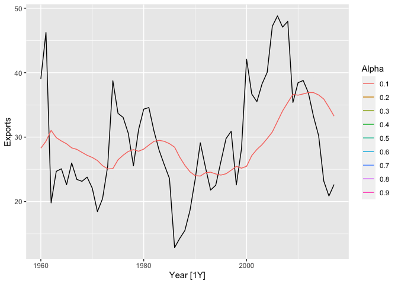

# Exponential smoothing

**Learning objectives:**

-   understand the mechanics of the most important exponential smoothing methods
-   recognize key components of the time series
-   explore statistical models that underlie exponential smoothing methods

## Simple Exponential smoothing

> Forecasts produced using exponential smoothing methods are weighted averages of past observations, with the weights decaying exponentially as the observations get older.

**Suitable for forecasting data with no clear trend or seasonal pattern**

The naïve method assumes that the most recent observation is the only important one, and all **previous observations provide no information** for the future.

**Weighted average** $\hat{y}_{T+h|T}=\frac{1}{T}\sum_{t=1}^T{y_t}$

With the Exponential smoothing a $0\leq\alpha\leq1$ is considered as smoothing parameter

-   Forecast equation: $\hat{y}_{t+h|t}=l_t$
-   Smoothing equation: $l_t=\alpha y_t + (1-\alpha)l_{t-1}$

$l_t$ is the **smoothed value** or the **level**

$$SSE=\sum_{t=1}^T(y_t-\hat{y}_{t|t-1})^2=\sum_{t=1}^T{e_t^2}$$

$e_t=y_y-\hat{y}_{t|t-1}$

```{r message=FALSE,warning=FALSE}
library(fpp3)

algeria_economy <- global_economy |>
  filter(Country == "Algeria")


algeria_economy |>
  autoplot(Exports) +
  labs(y = "% of GDP", title = "Exports: Algeria")
```

```{r}
# Estimate parameters
fit <- algeria_economy |>
  model(ETS(Exports ~ error("A") + trend("N") + season("N")))
```

Parameter estimates

```{r}
fit%>%coef()
```

```{r}
tb <- fit%>%augment()
tb[1:59,] %>%
  rename(Level=".fitted")%>%
  mutate(Time=c(0,seq(1,58,1)),
         Year=c(1959,seq(1960,2017,1)),
         Observation = lag(Exports),
         Forecast=lag(Level))%>%
  select(Year,Time,Observation,Level,Forecast)%>%head
```

```{r}
fc <- fit |>
  forecast(h = 5)
```

```{r}
fit |>
  forecast(h = 5) |>
  autoplot(algeria_economy) +
  geom_line(aes(y = .fitted), col="#D55E00",
            data = augment(fit)) +
  labs(y="% of GDP", title="Exports: Algeria") +
  guides(colour = "none")
```

Trend refers to the long-term pattern or direction of a time series. It represents the underlying growth or decline in the data over time. A trend can be upward, downward, or flat, and it can be linear or nonlinear. Trends can be caused by a variety of factors, such as changes in population, technology, or economic conditions.

Seasonality, on the other hand, refers to the pattern of regular fluctuations in a time series that occur at fixed intervals of time, such as daily, weekly, or monthly. Seasonality is often caused by factors such as weather, holidays, or other recurring events. Seasonality can be additive or multiplicative, depending on whether the size of the seasonal fluctuations is constant or varies with the level of the time series.

In summary, trend represents the long-term direction of a time series, while seasonality represents the regular fluctuations that occur at fixed intervals of time. Understanding the trend and seasonality of a time series is important for forecasting and modeling purposes, as it can help to identify the underlying patterns and behavior of the data.

```{r message=FALSE,warning=FALSE}
#| echo: false
#| 
library(fable)
library(tsibbledata)

alpha_range <- seq(0.1, 0.9, by = 0.1)

fits <- list() # create an empty list to store the model fits
for (alpha in alpha_range) {
  fit <- algeria_economy %>%
    model(ETS(Exports ~ error("A") +
                trend("N", alpha = alpha) +
                season("N")))
  fits[[as.character(alpha)]] <- fit
  # store the fit in the list using alpha as the key
}
```


```{r message=FALSE,warning=FALSE}
library(purrr)
pred <-
  map2_dfr(fits, 
           alpha_range, 
           ~ as_tibble(.x %>% augment() %>% 
                         mutate(alpha = .y))) %>%
  select(Year,Exports,.fitted,alpha)

pred <- pred%>%as_tibble()
```

```{r message=FALSE,warning=FALSE}
library(gganimate)
p <- algeria_economy |>
  autoplot(Exports) +
  geom_line(aes(y = .fitted,
                group=alpha,
                col=factor(alpha)),
            data =pred) +
  transition_states(alpha,
                    transition_length = 2,
                    state_length = 1) +
  ease_aes('linear')+
labs(y="Exports",color="Alpha") 
```

```{r echo=FALSE}
anim <- animate(p)
anim_save("images/ch_8_transition.gif", anim)
```

<center>

</center>

```{r}
components(fit) |> autoplot()
```

```{r}
components(fit) |>
  left_join(fitted(fit),by=c("Country",".model","Year"))%>%head
```

```{r}
fit |>
  forecast(h=5) |>
  autoplot(algeria_economy) +
  labs(y="% of GDP",
       title="Exports: Algeria")
```

## Methods

### Trend

```{r message=FALSE,warning=FALSE}
library(tidyverse)
aus_economy <- global_economy |>
  filter(Code == "AUS") |>
  mutate(Pop = Population / 1e6)
autoplot(aus_economy, Pop) +
  labs(y = "Millions", title = "Australian population")
```

```{r}
fit <- aus_economy |>
  model(
    AAN = ETS(Pop ~ error("A") + trend("A") + season("N"))
  )
fc <- fit |> forecast(h = 10)
```


## Exercises

### Exercise 5

Data set `global_economy` contains the annual `Exports` from many countries. 

#### Select one country to analyse.
```{r message=FALSE,warning=FALSE}
library(fpp3)
italy_economy <- global_economy %>%
  filter(Country=="Italy")

italy_economy %>% head
```


#### Plot the Exports series and discuss the main features of the data.

```{r}
italy_economy |>
  autoplot(Exports) +
  labs(y = "Exports", title = "Exports: Italy")
```
```{r}
italy_economy%>%
  tail()
```

#### Use an ETS(A,N,N) model to forecast the series, and plot the forecasts.
```{r}
# Estimate parameters
fit <- italy_economy |>
  model(ETS(Exports ~ error("A") + trend("N") + season("N")))
fit %>% tidy()
fc <- fit |>
  forecast(h = 5)
```


```{r}
fc |>
  autoplot(italy_economy) +
  geom_line(aes(y = .fitted), col="purple",
            data = augment(fit)) +
  labs(y="Exports", title="Exports: Italy") +
  guides(colour = "none")
```


#### Compute the RMSE values for the training data.

```{r}
italy_economy %>%
  as_tsibble() 
```
```{r}
italy_economy %>%
  model(ETS(Exports ~ error("A") + trend("N") + season("N"))) |>
    accuracy()
```


```{r}
italy_economy %>%
  as_tsibble() %>% 
  # Perform stretching windows on a tsibble by row
  stretch_tsibble(.init = 10)  |>
  model(ETS(Exports ~ error("A") + trend("N") + season("N"))) |>
    forecast(h = 1) |>
    accuracy(italy_economy) 
```


#### Compare the results to those from an ETS(A,A,N) model. 

```{r}
italy_economy %>%
  model(ETS(Exports ~ error("A") + trend("N") + season("N")),
        ETS(Exports ~ error("A") + trend("A") + season("N"))) |>
    accuracy()%>%
  select(.model,.type,RMSE)
```


```{r}
italy_economy |>
  as_tsibble() |>
  # Perform stretching windows on a tsibble by row
  stretch_tsibble(.init = 10)  |>
  model(SES = ETS(Exports ~ error("A") + trend("N") + season("N")),
        Holt = ETS(Exports ~ error("A") + trend("A") + season("N")),
        Damped = ETS(Exports ~ error("A") + trend("Ad") + season("N")))|>
    forecast(h = 1) |>
    accuracy(italy_economy) 
```

(Remember that the trended model is using one more parameter than the simpler model.) 

Discuss the merits of the two forecasting methods for this data set.

#### Compare the forecasts from both methods. 

Which do you think is best?
```{r}
fit <- italy_economy |>
  model(
    SES = ETS(Exports ~ error("A") + trend("N") + season("N")),
    Holt = ETS(Exports ~ error("A") + trend("A") + season("N"))
  )
fc <- fit |> forecast(h = "3 years")


fc |>
  autoplot(italy_economy, level = NULL) +
  labs(title="Italian Exports",
       y="Exports") +
  guides(colour = guide_legend(title = "Forecast"))
```

```{r}
italy_economy |>
  model(
    SES = ETS(Exports ~ error("A") + trend("N") + season("N")),
    Holt = ETS(Exports ~ error("A") + trend("A") + season("N"))
  ) |>
  forecast(h = 15) |>
  autoplot(italy_economy, level = NULL) +
  labs(title = "Italian Exports",
       y = "Exports") +
  guides(colour = guide_legend(title = "Forecast"))
```


Calculate a 95% prediction interval for the first forecast for each model, using the RMSE values and assuming normal errors. 
```{r}
fit |>
  forecast(h = 1) |>
  autoplot(italy_economy) +
  labs(x="Year", y="Exports",
       title = "Italian Exports")
```
```{r}
fit |>
  forecast(h = 1)
```

Compare your intervals with those produced using R.

Prediction intervals
A prediction interval gives an interval within which we expect $y_t$ to lie with a specified probability. For example, assuming that distribution of future observations is normal, a 95% prediction interval for the $h$ step forecast is:

$$\hat{y}_{T+h|T} \pm 1.96 \hat{\sigma}_h$$


```{r}
italy_economy |>
  model(
    SES = ETS(Exports ~ error("A") + trend("N") + season("N")),
    Holt = ETS(Exports ~ error("A") + trend("A") + season("N"))
  ) |>
  forecast(h = 1) |>
  hilo()
```


## Meeting Videos

````{=html}
<!--
### Cohort 2

`r knitr::include_url("https://www.youtube.com/embed/URL")`

<details>
<summary> Meeting chat log </summary>

```
LOG
```
</details>
-->
````
