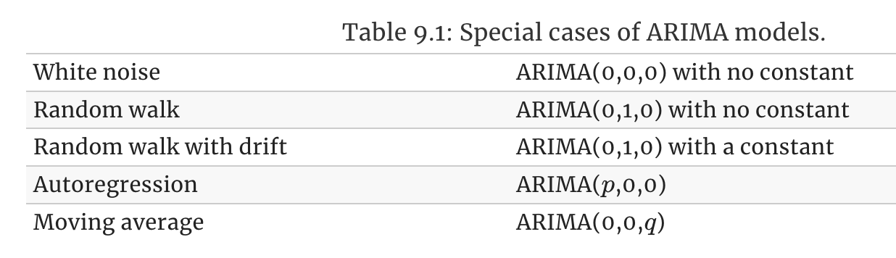
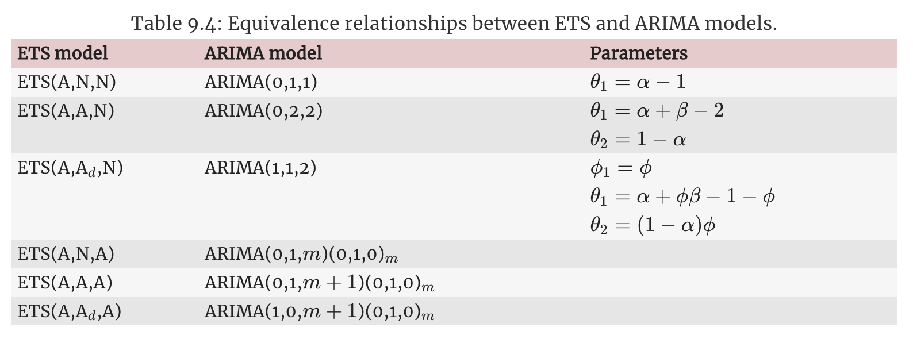

# ARIMA models

**Learning objectives:**


How to use ARIMA models


## Exercise 7

Consider `aus_airpassengers`, the total number of passengers (in millions) from Australian air carriers for the period 1970-2011. 

```{r warning=FALSE,message=FALSE}
# load packages
suppressMessages(library(tidyverse))
library(fpp3)
library(plotly)
theme_set(theme_minimal())
```

```{r}
# Australia air passengers dataset
aus_airpassengers%>%head
```


```{r}
# plot time series
aus_airpassengers %>% 
  autoplot(Passengers) + 
  geom_smooth(method = 'loess', se = FALSE, color = 'steelblue') + 
  labs(title = 'Australia Total Number of Passengers (millions)')

# KPSS test
aus_airpassengers %>% 
  features(Passengers, unitroot_kpss)

# differencing time series
aus_airpassengers %>% 
  mutate(Passengers = Passengers %>% 
           difference(1) %>%
           difference(1)) %>%
  autoplot(Passengers) + 
  labs(title = 'Australia Total Number of Passengers (change)')

aus_airpassengers %>% 
  mutate(Passengers = Passengers %>% 
           difference(1) %>% 
           difference(1)
  ) %>% 
  features(Passengers, unitroot_kpss)
```

### a. Use ARIMA() to find an appropriate ARIMA model. What model was selected. 


Check that the residuals look like white noise. Plot forecasts for the next 10 periods.
```{r}
fit_1 <- aus_airpassengers |> 
  model(ARIMA(Passengers))

report(fit_1)
tidy(fit_1)

# residuals plots
fit_1 %>% 
  gg_tsresiduals()

# forecasts for the next 10 years (periods)
fit_1 |> forecast(h=10) |>
  autoplot(aus_airpassengers) +
  labs(y = "Number of Passengers (millions)", 
       title = "Australia Total Number of Passengers")
```

### b. Write the model in terms of the backshift operator.

### c. Plot forecasts from an ARIMA(0,1,0) model with drift and compare these to part a.
```{r}
fit_2 <- aus_airpassengers |> 
  model(ARIMA(Passengers ~ 1 + pdq(0, 1, 0)))

report(fit_2)
tidy(fit_2)

# plot forecasts (h = 10)
fit_2 |> forecast(h=10) |>
  autoplot(aus_airpassengers) +
  labs(y = "Number of Passengers (millions)", 
       title = "Australia Total Number of Passengers")
```

### d. Plot forecasts from an ARIMA(2,1,2) model with drift and compare these to parts a. and c.

Remove the constant and see what happens.
```{r}
fit_3 <- aus_airpassengers |> 
  model(ARIMA(Passengers ~ 1 + pdq(2, 1, 2)))

report(fit_3)
tidy(fit_3)

# plot forecasts (h = 10)
fit_3 |> forecast(h=10) |>
  autoplot(aus_airpassengers) +
  labs(y = "Number of Passengers (millions)", 
       title = "Australia Total Number of Passengers")

# Arima without constant
fit_3_constant <- aus_airpassengers %>% 
  as.ts() %>% 
  forecast::Arima(c(2, 1, 2), include.constant = TRUE)

fit_3_constant

# auto.arima
aus_airpassengers %>% 
  as.ts() %>% 
  forecast::auto.arima()
```


### e. Plot forecasts from an ARIMA(0,2,1) model with a constant. What happens?
```{r}
fit_4 <- aus_airpassengers |> 
  model(ARIMA(Passengers ~ 1 + pdq(0, 2, 1)))

report(fit_4)
tidy(fit_4)

# plot forecasts (h = 10)
fit_4 |> forecast(h=10) |>
  autoplot(aus_airpassengers) +
  labs(y = "Number of Passengers (millions)", 
       title = "Australia Total Number of Passengers")
```


## Exercise 11

**Choose one of the following seasonal time series:** the Australian production (`aus_production`) of:

-   electricity
-   cement
-   gas

```{r message=FALSE,warning=FALSE}
aus_production%>%
  select(Quarter,Electricity) %>%
  head()
```

```{r}
aus_production%>%
  select(Quarter,Electricity) %>%
  pull(Quarter)%>%
  range()
```

### Do the data need transforming?

If so, find a suitable transformation.

```{r message=FALSE,warning=FALSE}
aus_production%>%
  select(Quarter,Electricity) %>% 
     drop_na() %>% 
     autoplot() + 
     geom_smooth(method = 'loess', se = FALSE, color = 'steelblue') + 
     labs(x = "Quarter", 
          y = 'Electricity in kWh (billion)', 
          title = 'Australian quarterly electricity production (1956 Q1 - 2010 Q2)')
```

```{r}
 aus_production%>%
  select(Quarter,Electricity) %>%
  gg_season(Electricity, period = "year")+
  theme(legend.position = "none") +
  labs(y="kWh (billion)", title="Australian Electricity production by year (1956-2010)")
```

```{r}
aus_production%>%
  select(Quarter,Electricity) %>%
  filter(year(Quarter) %in%c(1960,2000)) %>%
  mutate(year=year(Quarter))%>%
  ggplot(aes(Quarter,Electricity,group=year,color=factor(year)))+
  geom_line() +
  facet_wrap(vars(year),scales = "free_x") +
  labs(y="kWh (billion)", title="Australian Electricity production",color="Year")
```

> Classical decomposition methods assume that the seasonal component repeats from year to year.

> For many series, this is a reasonable assumption, but for some longer series it is not.

For example, `electricity demand` patterns have `changed over time` as air conditioning has become more widespread. In many locations, the seasonal usage pattern from several decades ago had its maximum demand in winter (due to heating), while the current seasonal pattern has its maximum demand in summer (due to air conditioning).

> Classical decomposition methods are unable to capture these seasonal changes over time.


### Are the data stationary?


If not, find an appropriate differencing which yields stationary data.


First step is to apply the `difference()` function. We can see that there is some `stationarity` in the data, but we need to apply further modifications in order to conform it.
```{r message=FALSE,warning=FALSE}
 aus_production%>%
  select(Quarter,Electricity) %>% 
  mutate(Electricity = difference(Electricity)) %>% 
     drop_na() %>% 
     autoplot() + 
     geom_smooth(method = 'loess', se = FALSE, color = 'steelblue') + 
     labs(x = "Quarter", 
          y = 'Electricity in kWh (billion)', 
          title = 'Australian quarterly electricity production (1956 Q1 - 2010 Q2)')
```


Let's check the Autocorrelation with the `ACF()` function, to see whether some lags appear in the data. We do this in the `orginal/observed` data and in the `differencing` data.
```{r}
p1 <- aus_production%>%
  select(Quarter,Electricity) %>% 
     drop_na() %>%
  ACF(Electricity) %>%
  autoplot()
```

```{r}
 p2 <- aus_production%>%
  select(Quarter,Electricity) %>% 
  mutate(Electricity = difference(Electricity)) %>% 
     drop_na() %>%
  ACF(Electricity) %>%
  autoplot()
```

```{r}
library(patchwork)
p1|p2
```


`Lags` appear to be very evident. Also, applying `ljung_box` option in the `features()` function, with a lag of 4.


```{r}
aus_production%>%
  select(Quarter,Electricity) %>% 
  mutate(Electricity = difference(Electricity)) %>% 
  drop_na() %>%
  features(Electricity, ljung_box, lag = 4)
```

So, we apply a differencing of 4:

    `Electricity = difference(Electricity, differences = 4)`

```{r message=FALSE,warning=FALSE}
aus_production%>%
  select(Quarter,Electricity) %>% 
  mutate(Electricity = difference(Electricity,differences = 4)) %>% 
     drop_na() %>% 
     autoplot() + 
     geom_smooth(method = 'loess', se = FALSE, color = 'steelblue') + 
     labs(x = "Quarter", 
          y = 'Electricity in kWh (billion)', 
          title = 'Australian quarterly electricity production (1956 Q1 - 2010 Q2)')
```

And then, again a difeerence of the differencing of 4:
```{r message=FALSE,warning=FALSE}
aus_production%>%
  select(Quarter,Electricity) %>% 
  mutate(Electricity = difference(Electricity,differences = 4),
         Electricity = difference(Electricity)) %>% 
     drop_na() %>% 
     autoplot() + 
     geom_smooth(method = 'loess', se = FALSE, color = 'steelblue') + 
     labs(x = "Quarter", 
          y = 'Electricity in kWh (billion)', 
          title = 'Australian quarterly electricity production (1956 Q1 - 2010 Q2)')
```


Essentially `it is not random`, which means that it is correlated with that of previous days. 

What happens if we apply the `log tranformation` as well as previous `differencing`? We can clearly see how the variance in the data changes:
```{r message=FALSE,warning=FALSE}
aus_production%>%
  select(Quarter,Electricity) %>% 
  mutate(Electricity = log(Electricity),
         Electricity = difference(Electricity,differences = 4),
         Electricity = difference(Electricity)) %>% 
     drop_na() %>% 
     autoplot() + 
     geom_smooth(method = 'loess', se = FALSE, color = 'steelblue') + 
     labs(x = "Quarter", 
          y = 'Electricity in kWh (billion)', 
          title = 'Australian quarterly electricity production (1956 Q1 - 2010 Q2)')
```

And, perform the autocorrelation checks:
```{r}
aus_production%>%
  select(Quarter,Electricity) %>% 
  mutate(Electricity = log(Electricity),
         Electricity = difference(Electricity,differences = 4),
         Electricity = difference(Electricity)) %>% 
  drop_na() %>%
  ACF(Electricity) %>%
  autoplot()
```

We still see many lags, to have a clearer vision of the applied transformation. In this visualization the last plot shows the best transformation to data:

     `Doubly differenced log Electricity` = difference(difference(log(Electricity), 4), 1)

```{r warning=FALSE,message=FALSE}
aus_production%>%
  select(Quarter,Electricity) %>% 
 transmute(
    `kWt (biillion)` = Electricity,
    `Log Electricity` = log(Electricity),
    `Annual change in log Electricity` = difference(log(Electricity), 4),
    `Doubly differenced log Electricity` = difference(difference(log(Electricity), 4), 1)
  ) %>%
  pivot_longer(-Quarter, names_to="Type", values_to="Electricity") |>
  mutate(
    Type = factor(Type, levels = c(
      "kWt (biillion)",
      "Log Electricity",
      "Annual change in log Electricity",
      "Doubly differenced log Electricity"))
  ) |>
  ggplot(aes(x = Quarter, y = Electricity)) +
  geom_line() +
  geom_smooth(linewidth=0.3,se=F,color="steelblue")+
  facet_grid(vars(Type), scales = "free_y") +
  labs(title = "Electricity", y = NULL)
```


Finally, the application of the `ACF()` to this last transformation let's us confirming the 4 lags option. To determine more objectively whether differencing is required is to use a `unit root test`. 

> In this test, the null hypothesis is that the data are stationary, and we look for evidence that the null hypothesis is false. 

So, we apply the `Kwiatkowski-Phillips-Schmidt-Shin (KPSS) test`, or `KPSS test p-value`.

```{r message=FALSE,warning=FALSE}
aus_production%>%
  select(Quarter,Electricity) %>%
  mutate(Electricity= difference(difference(log(Electricity), 4), 1)) %>%
  drop_na() %>%
  ACF() %>%
  autoplot()
```

The `KPSS test p-value` is reported as a number between 0.01 and 0.1. 

If we use it on observed data the result shows that the null hypothesis would need to be rejected, and the data would be not stationary. 

> What's happen if we apply our previous transformations?

```{r}
aus_production%>%
  select(Quarter,Electricity) %>% 
features(Electricity, unitroot_kpss)
```

**Differencing data appear stationary**
```{r}
aus_production%>%
  select(Quarter,Electricity) %>% 
  mutate(Electricity = difference(Electricity)) %>% 
features(Electricity, unitroot_kpss)
```

```{r}
aus_production%>%
  select(Quarter,Electricity) %>%
  mutate(Electricity= difference(difference(log(Electricity), 4), 1)) %>%
  drop_na() %>%
  features(Electricity, unitroot_kpss)
```

Further checks can be done with `unitroot_ndiffs` which in this case is 1, indicating that `one` seasonal difference is required.

```{r}
aus_production%>%
  select(Quarter,Electricity) %>% 
  features(Electricity, unitroot_ndiffs)
```

A further look at how the differencing changes, if we consider the `log()` and the `period differencing`. Four Quarters, or 4 periods are 1 year.
```{r message=FALSE,warning=FALSE}
aus_production %>%
  select(Quarter, Electricity)  |>
  mutate(Electricity=log(Electricity) %>% difference(4)) |>
  autoplot()
```
What if we use 8 periods?
```{r warning=FALSE,message=FALSE}
aus_production %>%
  select(Quarter, Electricity)  |> 
  mutate(Electricity=log(Electricity) %>% difference(8)) |>
  autoplot()
```
Just a remainder of what happen in 1 period.
```{r message=FALSE,warning=FALSE}
aus_production %>%
  select(Quarter, Electricity)  |>
  mutate(Electricity=log(Electricity) %>% difference(1)) |>
  autoplot()
```


### Which of the models is the best according to their AIC values?

Identify a couple of ARIMA models that might be useful in describing the time series.

    ARIMA(p,d,q) = autoregressive AR(p) + differencing d + moving average MA(q)

`ARIMA(1,0,1) model` - Auto Arima
```{r}
fit <- aus_production%>%
  select(Quarter,Electricity) %>%  
  model(ARIMA(Electricity))
report(fit)
```

Let's apply the `partial autocorrealtion` with the `PACF()` function:

```{r}
aus_production%>%
  select(Quarter,Electricity) %>% 
  mutate(Electricity = difference(Electricity)) %>% 
     drop_na() %>%
  PACF(Electricity) |>
  autoplot()
```

To see `ACF()` and `PACF()` together we can use `gg_tsdisplay()`
```{r message=FALSE,warning=FALSE}
aus_production %>%
  select(Quarter, Electricity)  |>
  gg_tsdisplay(difference(Electricity), plot_type='partial')
```

`ARIMA(4,0,0) model`

And then try with arima with 4 differencing.

    model(ARIMA(Electricity ~ pdq(4,0,0)))

```{r}
fit2 <- aus_production %>%
  select(Quarter, Electricity) %>%
  model(ARIMA(Electricity ~ pdq(4, 0, 0)))

report(fit2)
```

Results of the two models:

**Model: ARIMA(1,0,1)(1,1,2)[4] w/ drift  -  AICc = 3432.22 the best**
Model: ARIMA(4,0,0)(0,1,2)[4] w/ drift  -  AICc = 3441.83


### Do the residuals resemble white noise?

Estimate the parameters of your best model and do diagnostic testing on the residuals.
If not, try to find another ARIMA model which fits better.





`ARIMA(1,1,1) model`


Let's check another arima model with one:

     model(ARIMA(Electricity ~ pdq(1,1,1)))
     
     
```{r}
fit3 <- aus_production%>%
  select(Quarter,Electricity) %>%  
 model(ARIMA(Electricity ~ pdq(1,1,1)))

report(fit3)
```

Here we compare all models together:
```{r warning=FALSE,message=FALSE}
compare_fit <- aus_production%>% 
  select(Quarter,Electricity) |>
  model(arima400 = ARIMA(Electricity ~ pdq(4,0,0)),
        arima210 = ARIMA(Electricity ~ pdq(2,1,0)),
        arima111 = ARIMA(Electricity ~ pdq(1,1,1)),
        search = ARIMA(Electricity, stepwise=FALSE))

compare_fit |> pivot_longer(cols=everything(),
                            names_to = "Model name",
                            values_to = "Orders")
```

```{r}
glance(compare_fit) |> arrange(AICc) |> select(.model:BIC)
```

```{r}
compare_fit |>
  select(arima111) |>
  gg_tsresiduals()
```

```{r}
augment(compare_fit) |>
  filter(.model=='arima111') |>
  features(.innov, ljung_box, lag = 4, dof = 1)
```

```{r}
compare_fit |>
  forecast(h=6) |>
  filter(.model=='arima111') |>
  autoplot(aus_production)
```
```{r}
gg_arma(compare_fit |> select(arima111))
```


This last `gg_tsdisplay()` testes some other parameter values.
```{r warning=FALSE,message=FALSE}
aus_production%>% 
  select(Quarter,Electricity) |>
  gg_tsdisplay(difference(log(Electricity), 12),
               plot_type='partial', lag=36) +
  labs(title="Seasonally differenced", y="")
```


```{r warning=FALSE,message=FALSE}
aus_production%>% 
  select(Quarter,Electricity) |>
  gg_tsdisplay(difference(log(Electricity), 12)|> difference(),
               plot_type='partial', lag=36) +
  labs(title="Double differenced", y="")
```


```{r}
fit5 <- aus_production%>% 
  select(Quarter,Electricity) |>
  model(
    arima012011 = ARIMA(Electricity ~ pdq(0,1,2) + PDQ(0,1,1)),
    arima210011 = ARIMA(Electricity ~ pdq(2,1,0) + PDQ(0,1,1)),
    auto = ARIMA(Electricity, stepwise = FALSE, approx = FALSE)
  )
fit5 |> pivot_longer(everything(), 
                     names_to = "Model name",
                     values_to = "Orders")
```

### Compare the forecasts obtained using ETS()





Forecast `the next 24 months` of data using your preferred model. 
```{r}
observed_data <- aus_production%>% select(Quarter,Electricity)

forecast_data <- fit %>% 
  forecast(h=8) %>%
  as.data.frame()%>%
  select(Quarter,Electricity='.mean')%>%
  mutate(model="Arima101") %>%
  rbind(fit3 %>% 
  forecast(h=8) %>%
  as.data.frame()%>%
  select(Quarter,Electricity='.mean')%>%
   mutate(model="Arima111"))
```

```{r}
ggplot(mapping=aes(Quarter,Electricity))+
  geom_line(data=observed_data%>%filter(year(Quarter) > 2000)) +
  geom_line(data=forecast_data,
            aes(group=model,color=factor(model)),
            inherit.aes = TRUE,
            linewidth=0.3)+
  scale_color_viridis_d(begin = 0,end = 0.5,direction = -1)+
  labs(y = "kWt (billion)", 
       color="Model",
       title = "Australian Electricity 2-model forecast (24 months)")
```


`ETS (ExponenTial Smoothing)`

```{r}
aus_production |>
  select(Quarter,Electricity) |>
  stretch_tsibble(.init = 10) |>
  model(
    ETS(Electricity),
    ARIMA(Electricity)
  ) |>
  forecast(h = 8) |>
  fabletools::accuracy(aus_production) |>
  select(.model, RMSE:MAPE)
```

```{r}
# Estimate parameters
fit4 <- aus_production |>
  model(ETS(Electricity ~ error("A") + trend("Ad") + season("A")))
fc <- fit4 |>
  forecast(h = 8)

fc |>
  autoplot(aus_production) +
  geom_line(aes(y = .fitted), col="#D55E00",
            data = augment(fit)) +
  labs(y="kWt (billion)", title="Electricity: Australia") +
  guides(colour = "none")
```


## Meeting Videos

<!--
### Cohort 2

`r knitr::include_url("https://www.youtube.com/embed/URL")`

<details>
<summary> Meeting chat log </summary>

```
LOG
```
</details>
-->
