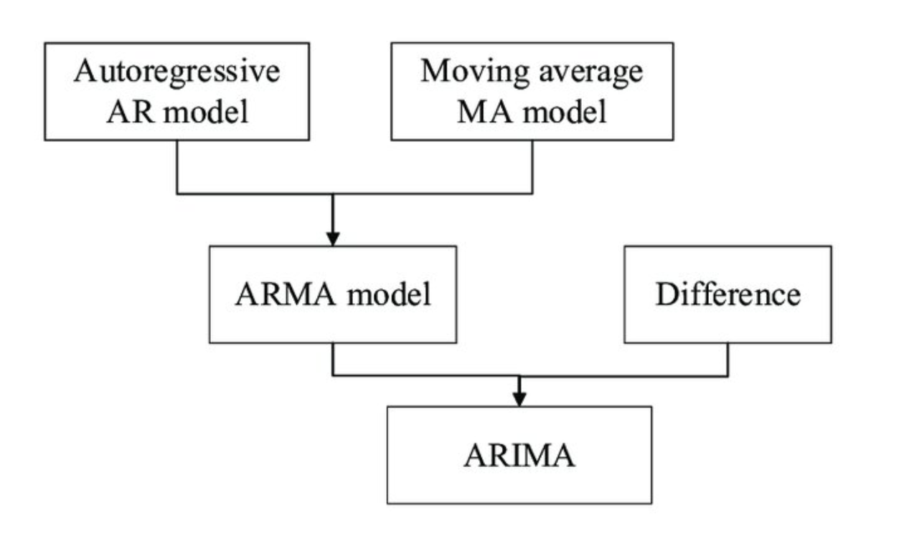

# Dynamic regression models

**Learning objectives:**


-  inclusion of other information that may also be relevant

    - the effects of holidays
    - competitor activity
    - changes in the law
    - the wider economy
    - other external variables
    
- extend ARIMA models   


This may explain some of the historical variation and may lead to more accurate forecasts.


## White Noise and Autocorrelation


In this chapter, the authors extend ARIMA models to include other information by allowing `the errors from a regression to contain autocorrelation`. The resulting model has two error terms, with only the ARIMA model errors assumed to be white noise.

<center>

</center>

To incorporate autocorrelation into regression errors, the authors `replace the traditional error term`, $\epsilon_t$, with $\eta_t$, which is `assumed to follow an ARIMA model`. 

$$ y_t=\beta_0 + \beta_1 x_{1,t} + ... + \beta_k x_{k,t} + \eta_t$$

$\eta_t$ follows an ARIMA(1,1,1) model: 

$$(1-\phi_1 B)(1-B)\eta_t(1+\theta_1B)\epsilon_t$$


> A regression model with ARIMA errors is equivalent to a regression model in differences with ARMA errors. 

- all of the variables in the model must first be stationary


## What is the Difference Between ARIMA and ARMA Model?

```{r echo=FALSE, fig.cap = "CC [Credibility Assessment Method of Sensor Data Based on Multi-Source Heterogeneous Information Fusion](https://www.researchgate.net/publication/350642995_Credibility_Assessment_Method_of_Sensor_Data_Based_on_Multi-Source_Heterogeneous_Information_Fusion/figures?lo=1)"}

```


ARMA model has two components **AR** Auto Regressive and **MA** Moving Average. ARIMA model has an additional component **Integration**.

ARMA models work well on stationary data whereas the ARIMA model works well on non-stationary data.

The integration component in the ARIMA model converts the non-stationary data into stationary data.

Integration is the number of times needed to difference a series in order to achieve stationarity.

ARMA model takes two parameters p and q. $ARMA(p,q)$ where p is the no of lags in the AR model and q is the no of lags in the MA model.
ARIMA model takes three parameters p,d and q. $ARMA(p,d,q)$ where d is no of differencing required to convert non-stationary data into stationary.

$$ARMA(p,q) \sim ARIMA(p,0,q)$$


## Example: US Personal Consumption and Income

Forecast changes in expenditure based on changes in income. In this case data are already stationary, and there is no need for any differencing.

```{r message=FALSE,warning=FALSE}
library(tidyverse)
library(fpp3)
us_change |>
  pivot_longer(c(Consumption, Income),
               names_to = "var", values_to = "value") |>
  ggplot(aes(x = Quarter, y = value)) +
  geom_line() +
  facet_grid(vars(var), scales = "free_y") +
  labs(title = "US consumption and personal income",
       y = "Quarterly % change")
```


```{r}
fit <- us_change |>
  model(ARIMA(Consumption ~ Income))
report(fit)
```

The model relases this ARIMA model selection: $$ARIMA(1,0,2) \text{ ; errors}$$

$$y_t=0.595+0.198x_t+ \eta_t$$
$$\eta_t=0.707 \eta_{t-1}+\varepsilon_t - 0.617 \varepsilon_{t-1}+ 0.207\varepsilon_{t-2}$$
$$\varepsilon_t \sim NID(0,0.311)$$

The `residual()` function applied on the model fit release the estimates for both: 

- $\eta_t$
- $\varepsilon_t$


```{r}
bind_rows(
    `Regression residuals` =
        as_tibble(residuals(fit, type = "regression")),
    `ARIMA residuals` =
        as_tibble(residuals(fit, type = "innovation")),
    .id = "type"
  ) |>
  mutate(
    type = factor(type, levels=c(
      "Regression residuals", "ARIMA residuals"))
  ) |>
  ggplot(aes(x = Quarter, y = .resid)) +
  geom_line() +
  facet_grid(vars(type))
```

```{r}
fit |> gg_tsresiduals()
```
```{r}
augment(fit) |>
  features(.innov, ljung_box, dof = 3, lag = 8)
```
## Forecast
```{r}
us_change_future <- new_data(us_change, 8) |>
  mutate(Income = mean(us_change$Income))
```


```{r}
forecast(fit, new_data = us_change_future) |>
  autoplot(us_change) +
  labs(y = "Percentage change")
```

## Difference between Stochastic and deterministic trends

$$y_t=\beta_0+\beta_1x+\eta_t$$

- Deterministic $\eta_t \sim ARIMA(p,0,q)$ 
- Stochastic $\eta_t \sim ARIMA(p,1,q)$

```{r}
fit_deterministic <- aus_airpassengers |>
  model(deterministic = ARIMA(Passengers ~ 1 + trend() +
                                pdq(d = 0)))

fit_stochastic <- aus_airpassengers |>
  model(stochastic = ARIMA(Passengers ~ pdq(d = 1)))
```


```{r echo=FALSE}
aus_airpassengers |>
  autoplot(Passengers) +
  autolayer(fit_stochastic |> forecast(h = 20),
    colour = "#0072B2", level = 95) +
  autolayer(fit_deterministic |> forecast(h = 20),
    colour = "#D55E00", alpha = 0.65, level = 95) +
  labs(y = "Air passengers (millions)",
       title = "Forecasts from trend models")
```

## Dynamics

For **long seasonal periods**, a `dynamic regression with Fourier terms` is often better than other models:
```{r}
aus_cafe <- aus_retail |>
  filter(
    Industry == "Cafes, restaurants and takeaway food services",
    year(Month) %in% 2004:2018
  ) |>
  summarise(Turnover = sum(Turnover))

fit <- model(aus_cafe,
  `K = 1` = ARIMA(log(Turnover) ~ fourier(K=1) + PDQ(0,0,0)),
  `K = 2` = ARIMA(log(Turnover) ~ fourier(K=2) + PDQ(0,0,0)),
  `K = 3` = ARIMA(log(Turnover) ~ fourier(K=3) + PDQ(0,0,0)),
  `K = 4` = ARIMA(log(Turnover) ~ fourier(K=4) + PDQ(0,0,0)),
  `K = 5` = ARIMA(log(Turnover) ~ fourier(K=5) + PDQ(0,0,0)),
  `K = 6` = ARIMA(log(Turnover) ~ fourier(K=6) + PDQ(0,0,0))
)

fit |>
  forecast(h = "2 years") |>
  autoplot(aus_cafe, level = 95) +
  facet_wrap(vars(.model), ncol = 2) +
  guides(colour = "none", fill = "none", level = "none") +
  geom_label(
    aes(x = yearmonth("2007 Jan"), y = 4250,
        label = paste0("AICc = ", format(AICc))),
    data = glance(fit)
  ) +
  labs(title= "Total monthly eating-out expenditure",
       y="$ billions")
```


## Impact of a predictor

```{r message=FALSE,warning=FALSE}
insurance %>%
  rename(lag0=TVadverts)%>%
  mutate(lag1=lag(lag0),
         lag2=lag(lag0,2))%>%
  pivot_longer(cols = c("lag0","lag1","lag2"),
               names_to = "lags",values_to="TVadverts")%>%
  ggplot(aes(x=TVadverts,y=Quotes,group=lags)) +
  geom_point()+
  geom_smooth()+
  facet_wrap(vars(lags))
```


## Meeting Videos

<!--
### Cohort 2

`r knitr::include_url("https://www.youtube.com/embed/URL")`

<details>
<summary> Meeting chat log </summary>

```
LOG
```
</details>
-->
