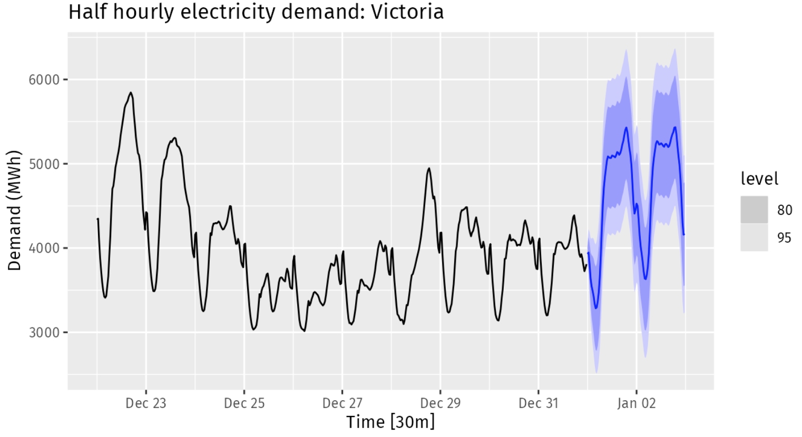
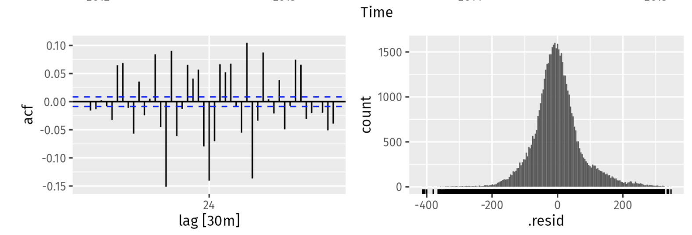
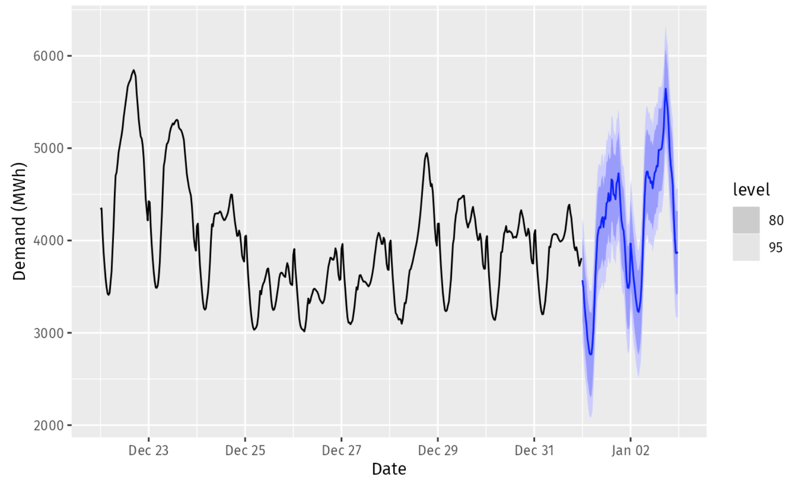
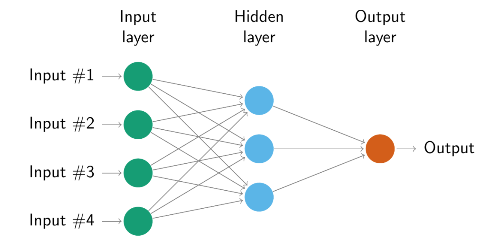

# Advanced forecasting methods

**Learning objectives:**

- learn about advanced forecasting methods
- deal with high frequency time series
- deal with complicated seasonal patterns

## Complex seasonality

Daily data:

- weekly pattern (365.25/7 $\approx$ 52.179 on average)
- annual pattern

Hourly data:

- daily pattern
- weekly pattern
- annual pattern

### Case Study 1

Number of calls (call volume) to a North American commercial bank per 5-minute interval between 7:00am and 9:05pm each weekday over a 33 week period. 

In this case we have a weak daily and weekly seasonal patterns: 

- on a total of `164 days` from March 03, 2003 to Oct 24, 2003.
- there are `169 5-minute intervals per day`: $$169×5=845$$
- a total of `845 minutes per day` (5-days a week) spent on bank calls. 

Let's have a look at the seasonality per day and per week.

```{r message=FALSE,warning=FALSE}
library(fpp3)
bank_calls%>%head()
```


```{r}
bank_calls%>%tail()
```

```{r}
bank_calls%>%
  mutate(date=as.Date(DateTime))%>%
  count(date)%>%
  head
```


```{r}
per_day <- bank_calls%>%
  mutate(date=as.Date(DateTime))%>%
  group_by(date)%>%
  reframe(tot_calls=sum(Calls))

per_day%>%dim
```

We cannot see a clear pattern for seasonality here.

```{r}
per_day %>%
  ggplot(aes(date,tot_calls))+
  geom_line()+
  geom_smooth(se=F)
```


```{r message=FALSE,warning=FALSE}
bank_calls |>
  fill_gaps() |>
  autoplot(Calls) +
  labs(y = "Calls",
       title = "Five-minute call volume to bank")
```

```{r}
bank_calls |>
  fill_gaps() %>%
  mutate(month=month(DateTime),
         day=day(DateTime),
         week=week(DateTime))%>%
  filter(month<4)%>%
  ggplot(aes(x=DateTime,y=Calls,group=week))+
  geom_line()
```

Have a look at **multiple seasonality** with the `STL()` decomposition:

```{r}
calls <- bank_calls |>
  mutate(t = row_number()) |>
  update_tsibble(index = t, regular = TRUE)
calls%>%head
```

```{r}
calls |>
  model(
    STL(sqrt(Calls) ~ season(period = 169) +
                      season(period = 5*169),
        robust = TRUE)
  ) |>
  components() |>
  select(t,season_169,season_845) %>%
  pivot_longer(cols = c("season_169","season_845"))%>%
  ggplot(aes(x=t,y=value)) + 
    geom_line()+
    facet_wrap(vars(name),ncol = 1,scales = "free")
```


Decomposition used in forecasting:
```{r}
# Forecasts from STL+ETS decomposition
my_dcmp_spec <- decomposition_model(
  STL(sqrt(Calls) ~ season(period = 169) +
                    season(period = 5*169),
      robust = TRUE),
  # ETS decomposition
  ETS(season_adjust ~ season("N"))
  )
```

Forecast `5*169` forward
```{r}
fc <- calls |>
  model(my_dcmp_spec) |>
  forecast(h = 5 * 169)
fc%>%head()
```


```{r}
# Add correct time stamps to fable
fc_with_times <- bank_calls |>
  new_data(n = 7 * 24 * 60 / 5) |>
  mutate(time = format(DateTime, format = "%H:%M:%S")) |>
  filter(
    time %in% format(bank_calls$DateTime, format = "%H:%M:%S"),
    wday(DateTime, week_start = 1) <= 5
  ) |>
  mutate(t = row_number() + max(calls$t)) |>
  left_join(fc, by = "t") |>
  as_fable(response = "Calls", distribution = Calls)
fc_with_times%>%head()
```


```{r}
# Plot results with last 3 weeks of data
fc_with_times |>
  fill_gaps() |>
  autoplot(bank_calls |> tail(14 * 169) |> fill_gaps()) +
  labs(y = "Calls",
       title = "Five-minute call volume to bank")
```

Apply **Fourier** for `multiple seasonalities`: fit a dynamic harmonic regression model with an ARIMA error structure.
```{r echo=FALSE}
doParallel::registerDoParallel()
```


```{r eval=FALSE}
fit <- calls |>
  model(
    dhr = ARIMA(sqrt(Calls) ~ PDQ(0, 0, 0) + pdq(d = 0) +
                  fourier(period = 169, K = 10) +
                  fourier(period = 5*169, K = 5)))
```


```{r eval=FALSE}
fc <- fit |> forecast(h = 5 * 169)
```


```{r}
# Add correct time stamps to fable
fc_with_times <- bank_calls |>
  new_data(n = 7 * 24 * 60 / 5) |>
  mutate(time = format(DateTime, 
                       format = "%H:%M:%S")) |>
  filter(
    time %in% format(bank_calls$DateTime, 
                     format = "%H:%M:%S"),
    wday(DateTime, week_start = 1) <= 5
  ) |>
  mutate(t = row_number() + max(calls$t)) |>
  left_join(fc, by = "t") |>
  as_fable(response = "Calls", distribution = Calls)
```

### Case Study 2

Electricity `demand` (MWh) in Victoria, Australia, during 2012–2014 (half-hourly) along with temperatures (degrees Celsius) for the same period for Melbourne.
```{r}
vic_elec %>% head
```

```{r}
vic_elec |>
  pivot_longer(Demand:Temperature, names_to = "Series") |>
  ggplot(aes(x = Time, y = value)) +
  geom_line() +
  facet_grid(rows = vars(Series), scales = "free_y") +
  labs(y = "")
```
```{r}
elec <- vic_elec |>
  mutate(
    DOW = wday(Date, label = TRUE),
    Working_Day = !Holiday & !(DOW %in% c("Sat", "Sun")),
    Cooling = pmax(Temperature, 18)
  )

elec%>%head
```


```{r}
elec |>
  ggplot(aes(x=Temperature, y=Demand, col=Working_Day)) +
  geom_point(alpha = 0.6) +
  labs(x="Temperature (degrees Celsius)", y="Demand (MWh)")
```

```{r eval=FALSE}
fit2 <- elec |>
  model(
    ARIMA(Demand ~ PDQ(0, 0, 0) + pdq(d = 0) +
          Temperature + Cooling + Working_Day +
          fourier(period = "day", K = 10) +
          fourier(period = "week", K = 5) +
          fourier(period = "year", K = 3))
  )
```


```{r echo=FALSE, eval=FALSE}
saveRDS(fit2,"data/12_fit2.rds")
```


new_data:
```{r eval=FALSE}
elec_newdata <- new_data(elec, 2*48) |>
  mutate(
    Temperature = tail(elec$Temperature, 2 * 48),
    Date = lubridate::as_date(Time),
    DOW = wday(Date, label = TRUE),
    Working_Day = (Date != "2015-01-01") &
                   !(DOW %in% c("Sat", "Sun")),
    Cooling = pmax(Temperature, 18)
  )
```


```{r eval=FALSE}
fc <- fit2 |>
  forecast(new_data = elec_newdata)
```


```{r eval=FALSE}
fc |>
  autoplot(elec |> tail(10 * 48)) +
  labs(title="Half hourly electricity demand: Victoria",
       y = "Demand (MWh)", x = "Time [30m]")
```




```{r eval=FALSE}
fit2|> gg_tsresiduals()
```




## Prophet model

The **Prophet model** it's a `nonlinear regression model` available via the {fable.prophet} package, it works best with time series that have strong seasonality and several seasons of historical data. The model is estimated using a **Bayesian approach** to allow for automatic selection of the change-points and other model characteristics.

$$y_t=g(t)+s(t)+h(t)+\epsilon_t$$

- $g(t)$ = piecewise-linear trend (or “growth term”)
- $s(t)$ = seasonal patterns
- $h(t)$ = holiday effects 
- $\epsilon_t$ = white noise error term


### Case Study 3

Quarterly cement production:
```{r}
library(fable.prophet)
```


```{r}
cement <- aus_production |>
  filter(year(Quarter) >= 1988)
cement%>%head
```


```{r}
train <- cement |>
  filter(year(Quarter) <= 2007)
```


```{r}
fit3 <- train |>
  model(
    arima = ARIMA(Cement),
    ets = ETS(Cement),
    prophet = prophet(Cement ~ season(period = 4, 
                                      order = 2,
                                      type = "multiplicative"))
    )
```


```{r}
fc3 <- fit3 |> 
  forecast(h = "2 years 6 months")
```


```{r}
fc3 |> autoplot(cement)
```

```{r}
fc3 |> 
  accuracy(cement)
```


### Case Study 4

Half-hourly electricity demand:
```{r}
elec <- vic_elec |>
  mutate(
    DOW = wday(Date, label = TRUE),
    Working_Day = !Holiday & !(DOW %in% c("Sat", "Sun")),
    Cooling = pmax(Temperature, 18)
  )
```

Faster than Dynamic harmonic regression models (DHR).

> The Prophet model adds a piecewise linear time trend which is not really appropriate here as we don’t expect the long term forecasts to continue to follow the downward linear trend at the end of the series.


```{r eval=FALSE}
fit4 <- elec |>
  model(
    prophet(Demand ~ Temperature + Cooling + Working_Day +
            season(period = "day", order = 10) +
            season(period = "week", order = 5) +
            season(period = "year", order = 3))
  )
```


```{r eval=FALSE}
fc <- fit4 |>
  forecast(new_data = elec_newdata)
```




## Vector autoregressions (VAR)


A `Bi-directional relationship` between response and predictors, such as in case of an increase in `income` $I_t$ leading to an increase in `consumption` $C_t$ and viceversa, is when every variable is assumed to influence every other variable in the system.  

> An example of such a situation occurred in Australia during the Global Financial Crisis of 2008–2009. The Australian government issued stimulus packages that included cash payments in December 2008, just in time for Christmas spending. As a result, retailers reported strong sales and the economy was stimulated. Consequently, incomes increased.


A VAR model is a generalisation of the univariate autoregressive model for forecasting a vector of time series. 

Variables are `endogenous`:

$$Y=y_{1,t},y_{2,t},...,y_{s,t}$$
$$y_{1,t}=c_1+\phi y_{1,t-1}+ \phi y_{2,t-1}+...+\epsilon_{1,t}$$


Forecasts are generated from a VAR in a recursive manner. 

- how many variables (K)
- how many lags (p)

A direct interpretation of the estimated coefficients is difficult. 

N. Coefficients:

$$K+pK^2$$
In VAR models often use the BIC instead of AIC.


### Case Study 5

Forecasting US consumption:
```{r}
fit5 <- us_change |>
  model(
    aicc = VAR(vars(Consumption, Income)),
    bic = VAR(vars(Consumption, Income), ic = "bic")
  )
fit5
```

```{r}
glance(fit5)
```

```{r}
fit5 |>
  augment() |>
  ACF(.innov) |>
  autoplot()
```

```{r}
fit5 |>
  select(aicc) |>
  forecast() |>
  autoplot(us_change |> filter(year(Quarter) > 2010))
```

## Neural network models

Example of a `multilayer feed-forward network`.

Each layer of nodes receives inputs from the previous layers. 

The outputs of the nodes in one layer are inputs to the next layer.




$$z_j=b_j+\sum_{1}^n{w_{i,j}x_{i,j}}$$

$$s(z)=\frac{1}{1+e^{-z}}$$
The weights starts with an assigned random value, and then updated using the observed data.

The model is **neural network auto-regressive** model $NNAR(p,k)$ where p are lagged inputs and k the nodes in the hidden layer.

$NNAR(p,0)$ model is equivalent to an $ARIMA(p,0,0)$
While $NNAR(p,P,k)_m$ is a model with more layers and it is equivalent to $ARIMA(p,0,0)(P,0,0)_m$

The default value for k is $k=(p+P+1)/2$

### Case Study 6

Sunspots, dark spots on the sun surface, follow a cycle of length between 9 and 14 years.
```{r}
sunspots <- sunspot.year |> 
  as_tsibble()
sunspots%>%head()
```


```{r}
fit6 <- sunspots |>
  model(NNETAR(sqrt(value)))
```

```{r}
fit6 %>% gg_tsresiduals()
```

Forecasting neural network time series is an iterative procedure, and might take a while to compile.

```{r eval=FALSE}
pred <- fit6 |>
  forecast(h = 1)
```


$$y_t=f(y_{t-1},\epsilon_t)$$

#### Bootstrap application

Here is a simulation of 9 possible future sample paths (times = 9), 30 years ahead (h = 30). 

```{r}
fit6 |>
  # bootstrapping
  generate(times = 9, h = 30) |>
  autoplot(.sim) +
  autolayer(sunspots, value) +
  theme(legend.position = "none")
```


## Bootstrapping and bagging

It is a transformation of the time series. 

The series is decomposed into `trend`, `seasonal` and `remainder` components using **STL**. 

And then the remainder is `bootstrapped` to obtain a  shuffled versions of it.

### Case Study 7

Consider the quarterly cement production in Australia from 1988 Q1 to 2010 Q2. First we check, that the decomposition has adequately captured the trend and seasonality, and that there is no obvious remaining signal in the remainder series.
```{r}
au_cement <- aus_production%>%
   filter(year(Quarter) >= 1988) |>
  select(Cement)

au_cement%>%head
```

```{r}
fit7 <- au_cement %>%
  model(stl=STL(Cement))
```

Time series decomposition
```{r}
fit7 %>%
  components() |>
  autoplot()
```

#### Generate several bootstrapped versions of the data
```{r}
fit7 |>
  generate(new_data = au_cement, times = 10,
           bootstrap_block_size = 8) |>
  autoplot(.sim) +
  autolayer(au_cement, Cement) +
  guides(colour = "none") +
  labs(title = "Cement production: Bootstrapped series",
       y="Tonnes ('000)")
```

### Bagging = bootstrap aggregating
 
To improve forecast accuracy, take the forecast of each of the additional time series, and calculate the average the resulting forecasts.

```{r}
sim <- fit7 %>%
  generate(new_data = au_cement, times = 100,
           bootstrap_block_size = 8) |>
  select(-.model, -Cement)
sim%>%head
```

fit an ETS model


```{r}
ets_forecasts <- sim |>
  model(ets = ETS(.sim)) |>
  forecast(h = 12)
```


```{r}
ets_forecasts |>
  update_tsibble(key = .rep) |>
  autoplot(.mean) +
  autolayer(au_cement, Cement) +
  guides(colour = "none") +
  labs(title = "Cement production: bootstrapped forecasts",
       y="Tonnes ('000)")
```


Avg the forecasts
```{r}
bagged <- ets_forecasts |>
  summarise(bagged_mean = mean(.mean))
```

>  bagging gives better forecasts than just applying ETS() directly. 


```{r}
au_cement |>
  model(ets = ETS(Cement)) |>
  forecast(h = 12) |>
  autoplot(au_cement) +
  autolayer(bagged, bagged_mean, col = "#D55E00") +
  labs(title = "Cement production in Australia",
       y="Tonnes ('000)")
```


## Exercises


## Meeting Videos

<!--
### Cohort 2

`r knitr::include_url("https://www.youtube.com/embed/URL")`

<details>
<summary> Meeting chat log </summary>

```
LOG
```
</details>
-->
